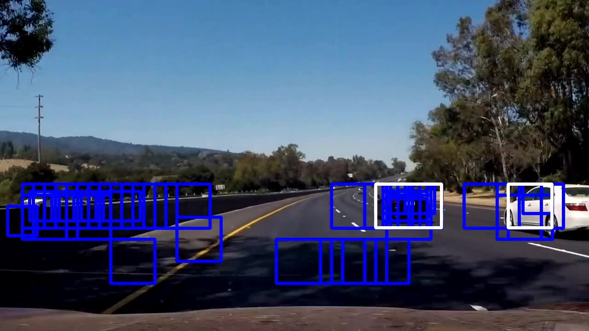

# Vehicle Detection Project

The notes for this project are best viewed on line at the
[github repo](https://github.com/carltonwin8/CarND-Vehicle-Detection).
It is easier to follow the links to the source code referenced in this documentation.
This readme is my completion of the Udacity project template provided at
[this repo](https://github.com/udacity/CarND-Vehicle-Detection).

The project code is developed using the
[spyder IDE](https://pythonhosted.org/spyder/)
and is made up of the following files.

  - [detect_vehicles.py](_modules/detect_vehicles.html) -
    The main vehicle detection module.
    The functions used to process various videos while varying some parameters.
  - [gen_output.py](_modules/gen_output.html) -
    Script used during the development and debug phase for visualization
    and used to generate the images used for the documentation.
  - [utils.py](_modules/utils.html)
    and
    [config.py](_modules/config.html) -
    Utility procedures and setup information.
  - [lesson_functions.py](_modules/lesson_functions.html) -
    The module that contains the procedures provided in the
    [Udacity Self-Driving Car Engineer Nanodegree](https://www.udacity.com/course/self-driving-car-engineer-nanodegree--nd013)
    lecture notes.

The following steps are done to complete this project.

  - A Linear SVC classifier is trained on a set of images labeled as cars and not-cars.
  - A feature vector made up of the following features is used for training.
      - A Histogram of Oriented Gradients (HOG),
      - A color transform with binned colors
      - A histograms of color
  - The feature vector is normalized and randomized before training and testing.
  - Vehicles are identify in an image by using a sliding-window technique to segment
    the image into blocks that are fed into the trained classifier.
  - The above process is applied to the images in a video stream to identify the cars.
  - A heat map identifies the locations of cars by summing all the blocks within
    an image that is identified as a car.
  - The heat map is also calculated from the last 20 fames of the image in order to
    reject outliers and follow detected vehicles.
  - Bounding boxes are drawn around detected vehicles.
  - The above procedure was run on
    [project_video.mp4](./project_video.mp4)


# Histogram of Oriented Gradients (HOG)

The
[get_hog_features](_modules/lesson_functions.html#get_hog_features)
function was called in order to generate the HOG images for an image  
in the `vehicle` and `non-vehicle` class.
The
[select_example_images](_modules/gen_output.html#select_example_images)
function was use to select the middle images from the small training data set
in order to get a feel for what the `skimage.feature.hog()` output looks like.
The
[gen_hog](_modules/gen_output.html#gen_hog)
function calls the
[get_hog_features](_modules/lesson_functions.html#get_hog_features)
function to generate the images below.
The following example images are converted to gray scale and the HOG features are detected
with the following parameters `orientations=9`, `pixels_per_cell=(8, 8)` and `cells_per_block=(2, 2)`.

<table width="100%">
<tr width="100%">
  <th align="center">Car</th>
  <th align="center">Car HOG</th>
  <th align="center">Not Car</th>
  <th align="center">Not Car HOG</th>
</tr>
<tr width="100%">
  <td width="23%"></td>
  <td width="23%"></td>
  <td width="23%"></td>
  <td width="23%"></td>
</tr>
</table>

The
[train_svm](_modules/lesson_functions.html#train_svm)
function used the hog parameters noted above to train and test a LinearSVC.
The SVC was trained by reading in the `vehicle` and `non-vehicle` images
and extracting the features, *scaling* them and then fitting them to the
classifier.
The test data was run through the classifier in order to see the accuracy
of the predictions based on the hog parameters selected.
The predictions for the HOG parameters noted above was determined to be
adequate when used with the large training data set.

Along with the HOG features, a
[color histogram](_modules/lesson_functions.html#color_hist)
and
[spatial binning](_modules/lesson_functions.html#bin_spatial)
of the image were
[combined](_modules/lesson_functions.html#single_img_features)
and used as features.

## Sliding Window Search

A sliding window was used on the test images in order to detect the cars.
The sub-sampling, of the full image HOG features, was used on the test
images in oder to speed up the image detection.
The
[find_cars](_modules/lesson_functions.html#find_cars)
function shows how the sub-sampling was used to determine the bounding box for the cars
using the parameter that were determined in the previous section.
The `cells_per_step` parameter was used to determine the overlap between the
sliding windows.

The
[get_cars](_modules/utils.html#detect.get_cars)
function calls the
[find_cars](_modules/lesson_functions.html#find_cars)
functions twice with a scale of 1 and 1.5 in order to detect
cars near and far.
Other values of scale can be used but were not necessary
in order to detect the cars correctly for the project video provided.
The
[get_cars](_modules/utils.html#detect.get_cars)
function also averaged the cars detected over a number of frames
and will be explained in the next section.
To improve the reliability of the classifier a number of feature combinations
[were tested](_modules/gen_output.html#process_images)
with the test images provided.
The
[configuration file](_modules/config.html)
shows some of the features that were tested out.

After the experimentation noted above the following features were selected for the feature vector:
  - a YCrCb 3-channel HOG features at two *scales*,
  - a 32x32 spatially binned color features and
  - a 32 bin histograms of 255 color features.

Heat map thresholding was used to reduce the multiple detects caused by overlapping
sliding windows and also by overlapping windows due to multiple scales.
The example images below show
the multiple detects (blue box) and the heat map threshold reduced to a single detect (white box).

| test1.jpg | test3.jpg | test4.jpg | test4.jpg |
| --- | --- | --- | --- |
|  |  |  |  |

### Video Implementation

Here is a [local link to the result video](./output_images/project_video.mp4)
and a [youtube video link](https://youtu.be/WdwQNmM1NbA).

In order to create the video shown at the link above, you first train and save the classifier via:
```
./detect_vehicles.py -d big -c 15 train
```
then you use the trained classifier on the project video by using the command shown below.
```
./detect_vehicles.py -d big -c 15 video -i 7 -t 16
```

In the
[get_cars](_modules/utils.html#detect.get_cars)
function the positions of the detections in each frame of the video
are stored for 20 consecutive frames in a FIFO.
A heat map is then created for the 20 frame history and a threshold of 16 is used
to identify a vehicle's position and filter out the transient false positives.
The `scipy.ndimage.measurements.label()` is used in the
[heat_map](_modules/lesson_functions.html#heat_map)
function to identify individual cars in the heat map.
A bounding box is drawn around the area where a car is detected.
The images below show the operation of the algorithm.
The blue boxes shows the detections over 20 frames and the white boxes
are the ones actually drawn on the video because they surpass the heat threshold.

| image004.jpg | image005.jpg | image005.jpg | image007.jpg |
| --- | --- | --- | --- |
|  |  |  |  |

## Discussion

A major issue in this project, is that in order to adequately test all the
possible parameters, that one can vary before and after training the classifier,
takes quite a bit of compute time per iteration.

Even with all that effort it is easy to see that this pipeline can fail if:

  - there were extreme shadows
  - the lighting condition varied from day to night or
  - trees or shrubs are present on the side of the road.

A straight forward way to improve this project is to test it with videos
the have the properties noted above and tune the parameters
for the highly changing environment.
