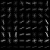

# Vehicle Detection Project

The notes for this project are best viewed on line at the
[github repo](https://github.com/carltonwin8/CarND-Vehicle-Dection).
It is easier to follow the link to the source code referenced in this documentation.
This readme is my completion of the Udacity project template provided at
[this repo](https://github.com/udacity/CarND-Vehicle-Dection).

The project code is developed using the
[spyder IDE](https://pythonhosted.org/spyder/)
and is made up of the following files.

  - [detect_vehicles.py](_modules/detect_vehicles.html) -
    The main vehicle detection module.
    The functions used to process various videos while varying some parameters.
  - [gen_output.py](_modules/gen_output.html) -
    Script used during the development and debug phase for visualization
    and used to generate the images used for the documentation.
  - [utils.py](_modules/utils.html)
    and
    [config.py](_modules/config.html)
    Utility procedures and setup information.
  - [lesson_functions.py](_modules/lesson_functions.html) -
    Module containing procedures provide in the
    [Udacity Self-Driving Car Engineer Nanodegree](https://www.udacity.com/course/self-driving-car-engineer-nanodegree--nd013)
    lecture notes.

The following steps are done to complete this project.

  - A Linear SVM classifier is trained on a set of images labeled as car and not-cars.
  - A feature vector made up of the following features is used for training.
      - A Histogram of Oriented Gradients (HOG),
      - A color transform with binned colors
      - A histograms of color
  - The feature vector is normalized and randomized before training and testing.
  - Vehicle are identify in an image by using a sliding-window technique to segment
    the image into blocks that are fed into the trained classifier.
  - The above process is applied to the images in a video stream to identify the cars.
  - A head map identifying the locations of cars by summing all the blocks within
    an image that is identified as a car.
  - The head map is also calculated from the last 20 fames of the image in order to
    reject outliers and follow detected vehicles.
  - Bounding boxes are drawn around detected vehicles.
  - The above procedure was run on
    [project_video.mp4](project_video.mp4)


# Histogram of Oriented Gradients (HOG)

The
[get_hog_features](_modules/lesson_functions.html#get_hog_features)
function was called in order to generate the HOG images for the
for one of each of the `vehicle` and `non-vehicle` classes.
The
[select_example_images](_modules/gen_output.html#select_example_images)
function was use to select the middle images from the small training data set
in order to get a feel for what the `skimage.feature.hog()` output looks like.
The
[gen_hog](_modules/gen_output.html#gen_hog)
function calls the
[get_hog_features](_modules/lesson_functions.html#get_hog_features)
function to generate the images below.
The following example images are converted to gray scale and the HOG features are detected
with the following parameters `orientations=9`, `pixels_per_cell=(8, 8)` and `cells_per_block=(2, 2)`.

<table width="100%">
<tr width="100%">
  <th align="center">Car</th>
  <th align="center">Car HOG</th>
  <th align="center">Not Car</th>
  <th align="center">Not Car HOG</th>
</tr>
<tr width="100%">
  <td width="23%"></td>
  <td width="23%"></td>
  <td width="23%"></td>
  <td width="23%"></td>
</tr>
</table>

The
[train_svm](_modules/lesson_functions.html#train_svm)
function used the hog parameters noted above train and test a LinearSVC.
The SVM was trained by reading in the `vehicle` and `non-vehicle` images
and extracting the features, scaling them and then fitting them to the
classifier.
The test data was run through the classifier in order to see the accuracy
of the predictions based on the hog parameters selected.  
The predictions for the HOG parameters noted above was determined to be
adequate when used with the large training data set.

Along with the HOG feature, a
[color histogram](_modules/lesson_functions.html#color_hist)
and
[spatial binning](_modules/lesson_functions.html#color_hist)
of the image were
[combined](_modules/lesson_functions.html#single_image_features)
used as features.
A
[number of feature combination](_modules/config.html#get_channel_ssahb_color)
[were tested](_modules/gen_output.html#process_images)
with the test images provided.

## Sliding Window Search

A sliding windows was used on the test images in order to detect images.
Sub-sampling of the HOG feature was used on the test images in oder to
speed up the image detection.
The
[find_cars](_modules/lesson_functions.html#find_cars)
function show how the sub-sampling was used to determine the bounding box for the cars
using the parameter that were determined in the previous section.

The
[get_cars](_modules/utils.html#get_cars) function
called the
[find_cars](_modules/lesson_functions.html#find_cars) functions
![alt text][image3]

####2. Show some examples of test images to demonstrate how your pipeline is working.  What did you do to optimize the performance of your classifier?

Ultimately I searched on two scales using YCrCb 3-channel HOG features plus spatially binned color and histograms of color in the feature vector, which provided a nice result.  Here are some example images:

![alt text][image4]
---

### Video Implementation

Here is a [local link to the result video](./project_video.mp4)
and a [youtube video link](https://youtu.be/WdwQNmM1NbA).

In order to create the video shown at the link above you first train and save the classifier via:
```
./detect_vehicles.py -d big -c 15 train
```
then you use the trained classifier on the project video by using the command shown below.
```
./detect_vehicles.py -d big -c 15 video -i 7 -t 16
```

####2. Describe how (and identify where in your code) you implemented some kind of filter for false positives and some method for combining overlapping bounding boxes.

I recorded the positions of positive detections in each frame of the video.
From the positive detections I created a heatmap and then thresholded that
map to identify vehicle positions.  
I then used `scipy.ndimage.measurements.label()` to identify
individual blobs in the heatmap.  I then assumed each blob corresponded
to a vehicle.
I constructed bounding boxes to cover the area of each blob detected.  

Here's an example result showing the heatmap from a series of frames of video,
the result of `scipy.ndimage.measurements.label()` and the bounding boxes
then overlaid on the last frame of video:

### Here are six frames and their corresponding heatmaps:

![alt text][image5]

### Here is the output of `scipy.ndimage.measurements.label()` on the
integrated heatmap from all six frames:
![alt text][image6]

### Here the resulting bounding boxes are drawn onto the last frame in the series:
![alt text][image7]

## Discussion

The major issue in this project is adequately testing all the possible parameters
one can vary before and after training the classifier takes quite a bit of
compute time for each iteration and the possible combination are large.

Even with all that effort it is easy to see that this pipeline can fail if:

  - there were extreme shadows
  - the lighting condition varied from day to night or
  - tree or shrubs are present on the side of the road.

A straight forward way to improve this project is to test it with videos
the have the properties noted above and tune parameters before and after
training for a highly changing environment.
